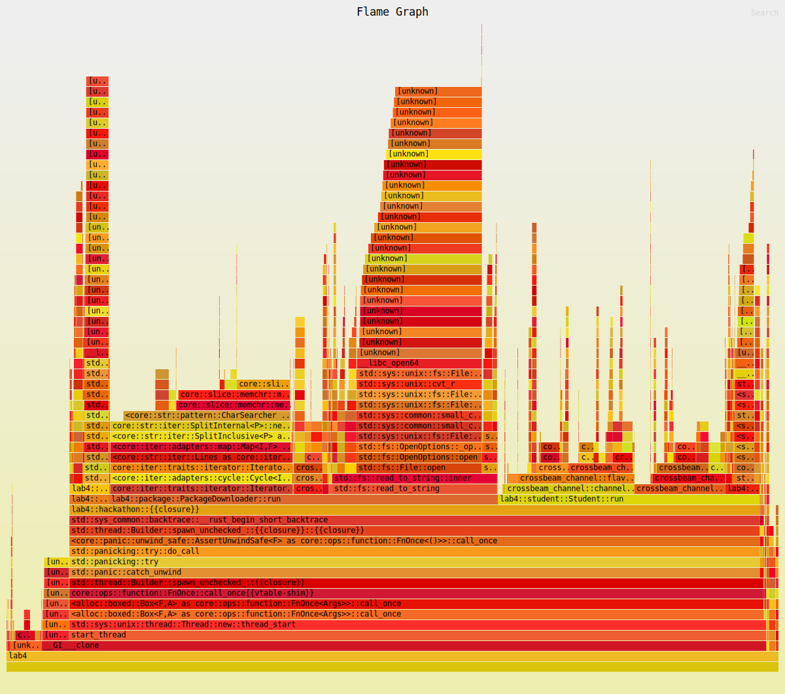
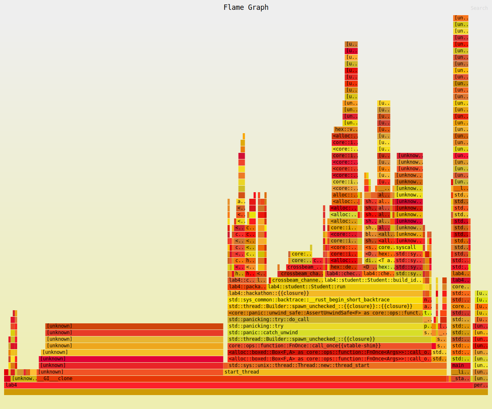

# Title

Optimization of Hackathon Locking and Threading

# Summary

Optimized hackathon program through improved mutex acquiring theory, resources shared between threads, separating message passing channels, and removing unnecessary intermediate printing. Mutex theory changed from locking during computation and updating mutex to pre-processing and only locking for updating afterwards. Data shared between all threads initially computed by each thread in a wasteful manner is now pre-computed and a formatted array of data is passed to each thread for utilization. A separate message passing channel was created to remove irrelevant event traffic during computation. Intermediate printing functionally and corresponding mutex allocation were removed to reduce time spent waiting for locks.

# Technical details

Multiple revisions of analyzing flamegraphs, measuring performance metrics, and static code analysis were performed to optimize the Hackathon program.

Upon visual analysis of the program, multiple files were frequently and redundantly read in each thread. This was modified to have a single read of the packages, ideas-products, and ideas-customers in the main.rs file to remove redundant IO reads. Additionally the cross product of ideas-products and ideas-customers was pre-computed in this main file. Both the packages and ideas cross product files were converted into arrays to improve access speed. These arrays were arc cloned and passed to the corresponding threads, with their internal code modified to make use of this optimized input.

The flamegraph showed a one of the largest computation times were spent waiting to acquire a the checksum update mutex. This was because the global checksum mutex would be acquired, begin the hashing of the corresponding idea or package, then update the global checksum. The hashing function is relatively slow and significantly delays this process. To resolve this, a dummy checksum variable was created to compute the intermediate checksum hashing and updates, without the need to lock a mutex. Once these intermediate computations were completed, the global mutex was acquired and updated with the result of the intermediate variable.

A large portion of the flamegraph was a consequent of lots of unnecessary traffic through the single message passing channel. To optimize needing to frequently divert events not currently needed to the back of the queue (or an alterative caching strategy), multiple message passing channels were made for each event type. This allowed for all receives of a specific event type to guarantee immediate results of that event type. These channels were passed to the corresponding threads.

The simplest way to improve performance is to remove unnecessary functionality. As per Piazza Q446, the intermediate prints are no longer required. Printing is a relatively slow IO operation. Additionally, the there were time losses from requiring a print mutex to print each student's data together. Accordingly, the entire intermediate printing functionality was removed.

Additional minor optimizations in each thread were developed to remove redundancy, better utilize the previously mentioned updates, and improve overall performance.

# Testing for correctness

These updates were tested for correctness with multiple methods. As per Piazza Q500, correctness is determined by having matching final global checksums. To facilitate this, the output of the original program was compared the output of the updated program and verified to match. Additionally, a simple python program was used to compare the outputs to ensure they match. This was used both to ensure the corresponding idea and student final global checksums match, as well as the original program and updated program's output for different number of packages in the make file from 10k to 100k per Piazza Q518. This compare program and related text files are stored in the testing folder for transparency. Finally, the "poison pill" of OutOfIdeas thread termination event was tested by replacing the message sent from "true" to "false" - this resulted in the program looping forever until the program was manually cancelled. This ensures that the out of ideas thread event is the deciding factor to terminate a thread.

# Testing for performance.

The code was tested for performance using hyperfine and flamegraphs.

The hyperfine command was used to measure program runtime. The program was tested with packages of size 10k-100k on multiple mostly unloaded eceterm systems. The hyperfine command `hyperfine --warmup 3 -i "target/release/og_lab4" "target/release/lab4"` was run on both the original and new release after the output was verified to be correct in order to compare the execution time and relative performance improvement. Additionally, --warmup was used to run the command multiple times before the actual benchmarking begins to allow the system to "warm up" and stabilize, ensuring that any initial system variability or startup costs are not included in the benchmarking results. The majority of testing was done on ecetesla0, with an average performance improvement of 12x-19x depending on system and load. Results from mostly unloaded systems were consistently above 14x improvement.

Example on a mildly-loaded ecetesla0 machine at time of submission:

```
Benchmark #1: target/release/og_lab4
  Time (mean ± σ):      1.690 s ±  0.276 s    [User: 1.719 s, System: 0.158 s]
  Range (min … max):    1.229 s …  2.127 s    10 runs

Benchmark #2: target/release/lab4
  Time (mean ± σ):     118.6 ms ±  32.8 ms    [User: 81.7 ms, System: 3.5 ms]
  Range (min … max):    70.3 ms … 221.8 ms    27 runs

Summary
  'target/release/lab4' ran
   14.25 ± 4.58 times faster than 'target/release/og_lab4'
```

The flamegraph was analyzed to determine what portions of the program are consuming the most cpu cycles. Upon viewing the initial flame graph, it became apparent that the hackathon main file composed of IdeaGenerator, PackageDownloader, and Student were the main culprits. More intensive analysis of this flamegraph can be seen above. On the other hand, the final flamegraph shows a very different image. Half of the flamegraph is composed of Unknown calls related to **GI\_**clone. This is representative of cycles spent on allocating memory for threads, which is not something we can modify as per the assignment document. This unknown section is barely visible on the initial flamegraph and can be interpreted as a consistent duration for comparison between both initial and final programs, corresponding in a significant time improvement. Additionally, the work is much more evenly split across the program. Finally, there is an apparent difference of IO reads, processing duration, and prints between the initial and final flamegraphs as per the redundancy improvement mentioned earlier. Please see flamegraphs in the commit-log folder and/or below depending on GitLab rendering.

### Initial Flamegraph



### Final Flamegraph


